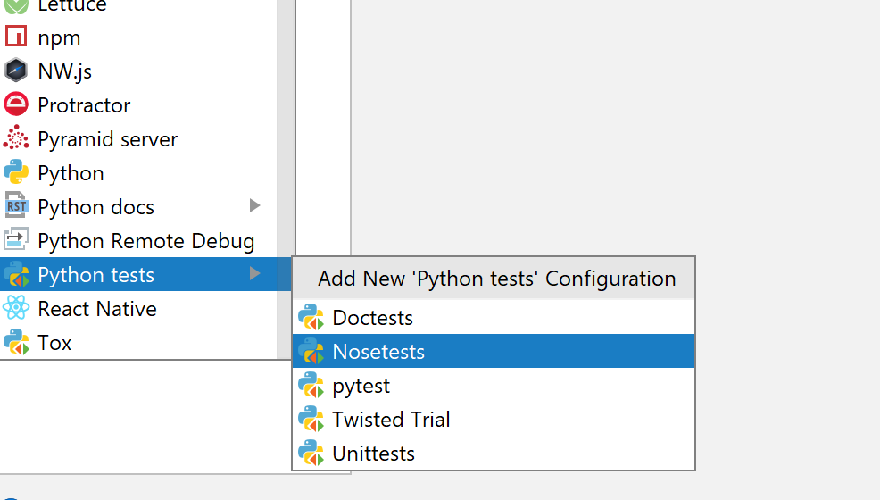
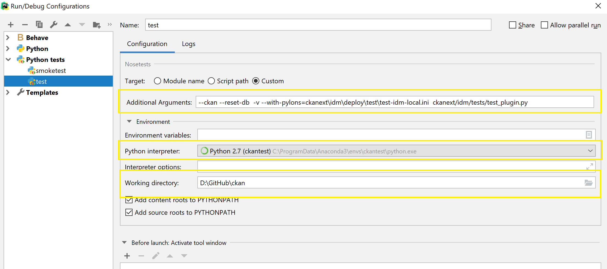
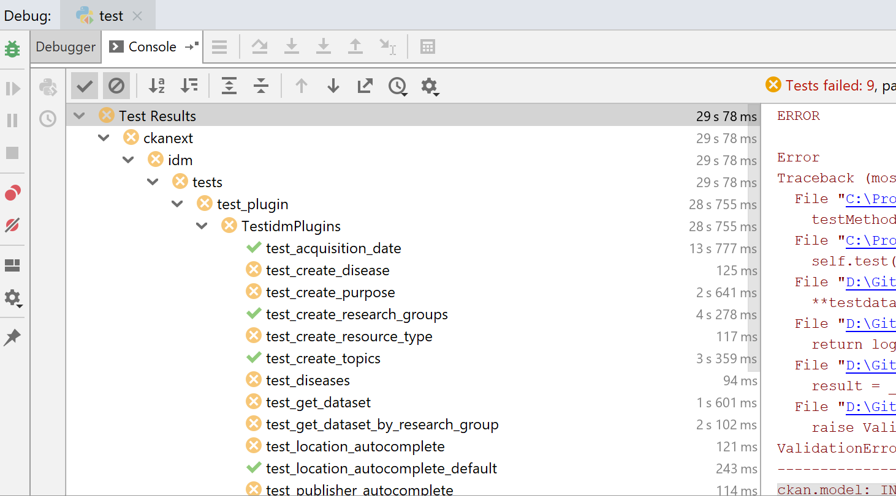

## This is a short description on how to debug Ckan on your windows machine ##

**Step1:**
Run a windows ckan setup( instruction is in idm\deploy\README.md

**Step2:**
Open idm\deploy\test\.env file and change CKAN\_TEST\_RUN=False

**Step3:**
In a command line window, go to idm\deploy\test, run "run-docker-compose.cmd", this will launch the test docker containers

**Step4:**
Go to Pycharm -> Click Run -> Edit Configurations 
Select "Python tests" -> Nosetests

**Step5:
Change the configuration**

Additional arguments: --ckan --reset-db  -v --with-pylons=ckanext\idm\deploy\test\test-idm-local.ini  ckanext/idm/tests

Python interpreter: choose the anacoda env that you have created in step1

Working directory: root folder of ckan

**Step6:**

Click the Debug to run, as tests run you should be able to see the tests shown in the debugger tab. 

